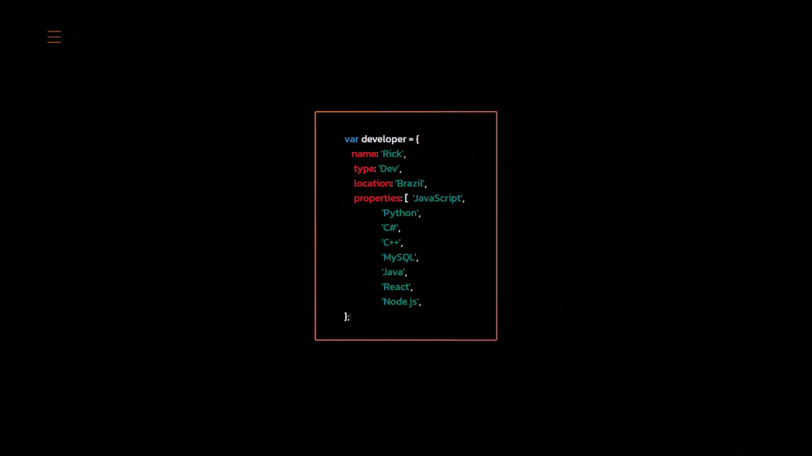
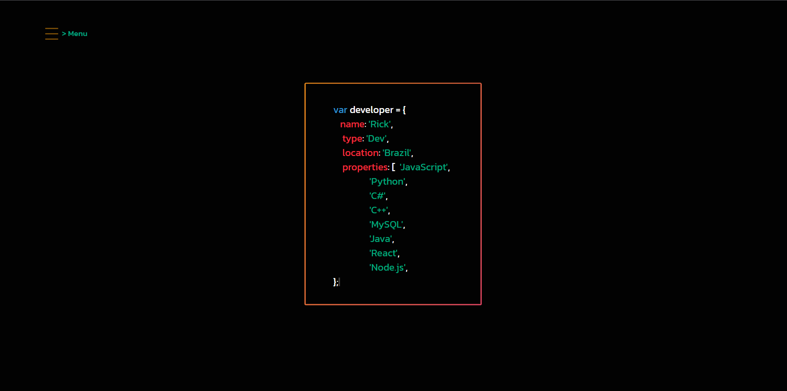
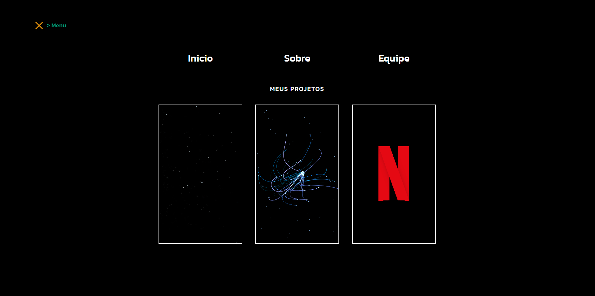

# primeiro-portfolio

Este foi o meu primeiro portfólio que desenvolvi. Embora reconheça algumas limitações, como a falta de responsividade para dispositivos móveis, acredito que ele contém muitos elementos interessantes que gostaria de compartilhar.

## Prévia

### Visualização Inicial

### Visualização Menu

 **Recursos Interativos**
- **Efeito de Escrita:** Apresenta uma simulação realista de alguém digitando as informações, proporcionando uma experiência imersiva.

- **Menu com Animação em Tela Cheia:** Oferece uma navegação dinâmica e visualmente atraente, elevando a interatividade do usuário.

- **Efeitos de Botão e Transição de Páginas:** Elementos que enriquecem a experiência do usuário ao navegar pelo portfólio.

Apesar de suas limitações atuais, estou orgulhoso do progresso alcançado e continuarei trabalhando para aprimorar minhas habilidades e futuras iterações do meu portfólio.

# Tecnologias utilizadas

- HTML5, CSS, JavaScript

# Autor

R. Gonçalves
https://www.linkedin.com/in/unic-ri/

